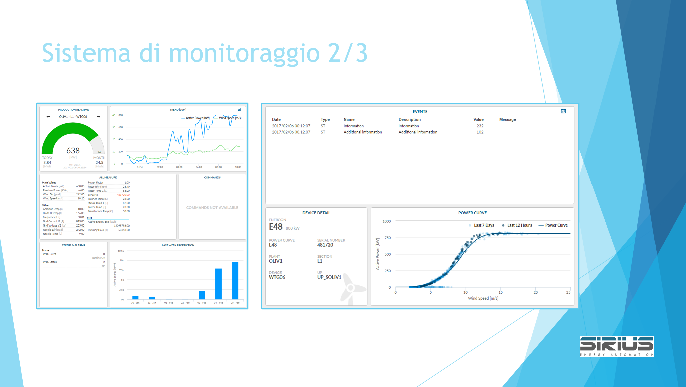
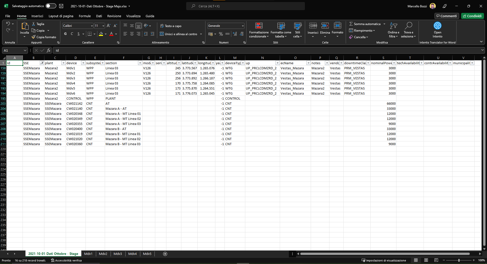
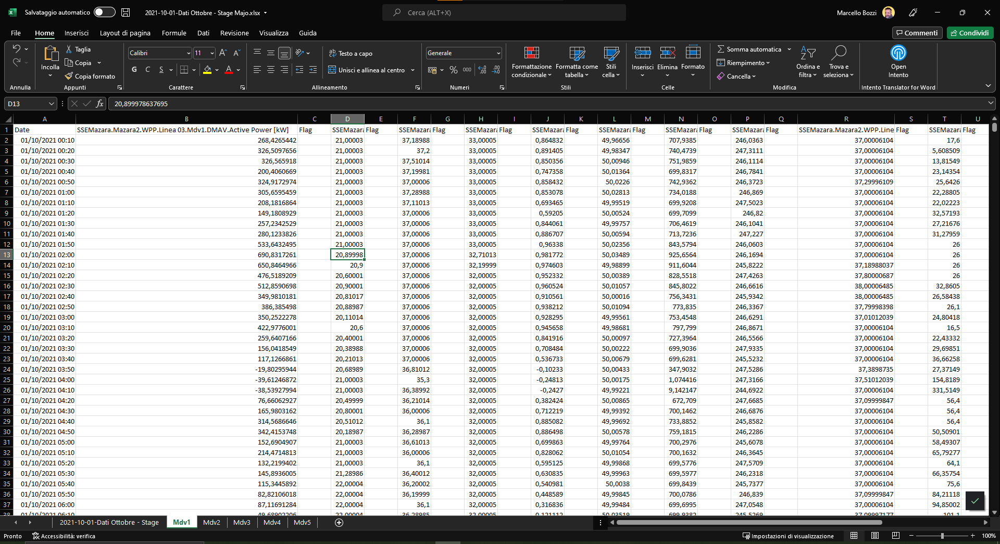

# Traccia

Progetta e realizza una web application che gestisca e mostri i dati di un parco eolico così come forniti dalla società Sirius. 

Il progetto deve essere originale, e comprendere una interfaccia front end sviluppata con tecnologia Web/AJAX ed un back end sviluppato con tecnologia Microsoft sotto forma di API REST.

Il lavoro deve essere svolto in gruppo ed il supporto di consegna principale sarà GitHub. 

Ogni gruppo svilupperà sia il front end sia il backend.

Il progetto accrediterà ore per i PCTO e verrà sviluppato in laboratorio durante le ore della materia Informatica e TPSIT.

## Sviluppo front end

Le persone che si occuperanno della porzione di soluzione che elabora il front end dovranno sviluppare l’interfaccia utente Web che consentirà di consultare i dati delle pale eoliche monitorate. 
Il progetto dovrà comprendere almeno:
- una pagina di elenco delle pale eoliche di uno specifico parco
- una pagina di dettaglio dei grafici di una pala eolica
- il grafico detto "Power Line" più due grafici di altrettante grandezze caratterizzanti il funzionamento della pala eolica
- le specifiche delle chiamate REST che si pensa di effettuare per ottenere i dati necessari e relative risposte JSON

I dati verranno mostrati anche con l’ausilio di grafici, le immagini seguenti, fornite da Sirius, costituiscono un esempio dell’interfaccia attesa:

Le informazioni verranno lette dalla porzione back end attraverso una serie di URI da chiamare con una HTTP Request, la risposta a tali chiamate sarà fornita in formato JSON. 

Per esempio la Application Programming Interface (API) REST potrebbe fornire la seguente chiamata:

https://localhost:23456/elenco-pale

che potrebbe rispondere con:

    [
      {
        "id":1,
        "sse":"SSEMazara",
        "plant":"Mazara1",
        "device":"Mdv1",
        "subsystem":"WPP",
        "section":"Linea 03",
        "model":"V126",
        "serial":"pippo",
        "altitude":282,
        "latitude":3773728,
        "longitude":1265830,
        "year":-1,
        "deviceType":"WTG",
        "up":"UP_PRCLCDMZRD_2",
        "ecName":"Vestas_Mazara",
        "notes":"Mazara2",
        "vendor":"Vestas",
        "downtimeClass":"PRM_VESTAS",
        "nominalPower":8200,
        "techAvailability":" ",
        "contrAvailability":" ",
        "municipality":" "
      },
      {
        "id":2,
        "sse":"SSEMazara",
        "plant":"Mazara1",
        "device":"Mdv1",
        "subsystem":"WPP",
        "section":"Linea 03",
        "model":"V126",
        "serial":"pippo",
        "altitude":282,
        "latitude":3773728,
        "longitude":1265830,
        "year":-1,
        "deviceType":"WTG",
        "up":"UP_PRCLCDMZRD_2",
        "ecName":"Vestas_Mazara",
        "notes":"Mazara2",
        "vendor":"Vestas",
        "downtimeClass":"PRM_VESTAS",
        "nominalPower":8200,
        "techAvailability":" ",
        "contrAvailability":" ",
        "municipality":" "
      },
      {
        "id":3,
        "sse":"SSEMazara",
        "plant":"Mazara1",
        "device":"Mdv1",
        "subsystem":"WPP",
        "section":"Linea 03",
        "model":"V126",
        "serial":"pippo",
        "altitude":282,
        "latitude":3773728,
        "longitude":1265830,
        "year":-1,
        "deviceType":"WTG",
        "up":"UP_PRCLCDMZRD_2",
        "ecName":"Vestas_Mazara",
        "notes":"Mazara2",
        "vendor":"Vestas",
        "downtimeClass":"PRM_VESTAS",
        "nominalPower":8200,
        "techAvailability":" ",
        "contrAvailability":" ",
        "municipality":" "
      }
    ]

## Sviluppo back end
I gruppi che si occuperanno della porzione di soluzione che elabora il front end dovranno progettare il database che consente di immagazzinare e gestire i dati del file Excel fornito dall’azienda Sirius, importare i dati forniti e sviluppare una applicazione server web che espone una API REST in grado di supportare il front end.
Facendo riferimento a quanto indicato per il front end, le URI implementate dovranno comprendere il supporto di almeno:

- una pagina di elenco delle pale eoliche di uno specifico parco
- una pagina di dettaglio dei grafici di una pala eolica
- i dati per il grafico detto "Power Line" più i dati per due grafici di altrettante grandezze caratterizzanti il funzionamento della pala eolica

Inoltre, si richiede di:

- Fornire le specifiche delle chiamate REST che si pensa di supportare per offrire i dati necessari e relative risposte JSON
- Sviluppare la soluzione utilizzando la tecnologia Microsoft studiata a lezione, implementando un progetto Web API ASP.NET Core
- Il progetto del database dovrà comprendere un Diagramma E-R esplicativo della struttura dati scelta e la descrizione delle ipotesi aggiuntive che si ritiene necessario addurre.

Le seguenti immagini illustrano parzialmente il documento Excel fornito:

